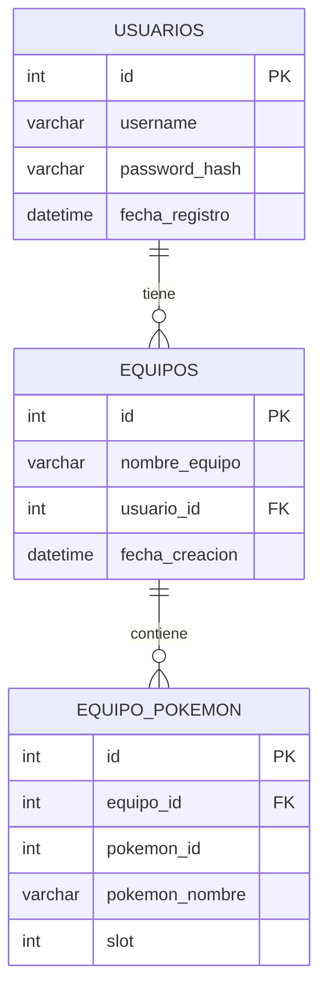

# ⚔ Pokémon Battle Teams

Aplicación web para armar y guardar equipos de batalla Pokémon. Cada usuario tiene su propia cuenta y sus propios equipos, almacenados en una base de datos local con XAMPP.

---

## Tabla de contenidos

1. [Descripción general](#1-descripción-general)
2. [Tecnologías utilizadas](#2-tecnologías-utilizadas)
3. [Estructura del proyecto](#3-estructura-del-proyecto)
4. [Base de datos](#4-base-de-datos)
5. [Modelo Entidad-Relación](#5-modelo-entidad-relación)
6. [Backend — API PHP](#6-backend--api-php)
7. [Frontend — JavaScript](#7-frontend--javascript)
8. [Flujo completo de usuario](#8-flujo-completo-de-usuario)
9. [Seguridad](#9-seguridad)
10. [Instalación y puesta en marcha](#10-instalación-y-puesta-en-marcha)
11. [Comandos útiles en MariaDB](#11-comandos-útiles-en-mariadb)
12. [Errores comunes](#12-errores-comunes)
13. [Mockups de vistas](#13-mockups-de-vistas)

---

## 1. Descripción general

Pokémon Battle Teams es una aplicación web que corre localmente con XAMPP. Permite a múltiples usuarios registrarse, iniciar sesión y crear equipos de hasta 6 Pokémon, que se guardan en una base de datos MariaDB. La información de los Pokémon se obtiene en tiempo real desde la [PokéAPI](https://pokeapi.co/), una API pública y gratuita.

**Características principales:**
- Registro e inicio de sesión con contraseña encriptada.
- Cada usuario ve y gestiona únicamente sus propios equipos.
- Navegación por más de 1000 Pokémon organizados en cajas (PC Box).
- Visualización de datos de cada Pokémon: tipos, altura, peso y estadísticas base.
- Guardado, visualización y eliminación de equipos de batalla.
- Sesión persistente en el navegador (no se pierde al recargar la página).

---

## 2. Tecnologías utilizadas

| Capa | Tecnología | Para qué se usa |
|---|---|---|
| Servidor local | XAMPP | Corre Apache y MariaDB en el computador |
| Base de datos | MariaDB | Guarda usuarios, equipos y Pokémon |
| Backend | PHP | API REST sencilla que responde JSON |
| Frontend | HTML + CSS + JavaScript | Interfaz del usuario en el navegador |
| API externa | PokéAPI | Trae la lista e información de los Pokémon |
| Fuente | Google Fonts (Press Start 2P) | Estética retro tipo Game Boy |

---

## 3. Estructura del proyecto

```
web_api_pokemon/
│
├── index.html          → Página principal (pantalla de auth + app)
├── styles.css          → Estilos visuales de toda la aplicación
├── script.js           → Lógica del navegador (auth, PokéAPI, equipos)
│
├── db.php              → Conexión a MariaDB
├── usuarios.php        → API de registro y login
├── equipos.php         → API de gestión de equipos
│
└── crear_base_de_datos.sql  → Script para crear la BD desde cero
```

---

## 4. Base de datos

La base de datos se llama `pokemon_box` y tiene tres tablas.

### 4.1 Tabla `usuarios`

Almacena las cuentas de los entrenadores.

| Columna | Tipo | Descripción |
|---|---|---|
| `id` | INT AUTO_INCREMENT PK | Identificador único del usuario |
| `username` | VARCHAR(50) UNIQUE | Nombre de usuario, no puede repetirse |
| `password_hash` | VARCHAR(255) | Contraseña encriptada con `password_hash()` |
| `fecha_registro` | DATETIME | Se llena automáticamente al crear la cuenta |

### 4.2 Tabla `equipos`

Almacena cada equipo creado, vinculado al usuario propietario.

| Columna | Tipo | Descripción |
|---|---|---|
| `id` | INT AUTO_INCREMENT PK | Identificador único del equipo |
| `nombre_equipo` | VARCHAR(50) | Nombre que le dio el usuario al equipo |
| `usuario_id` | INT FK | Referencia al usuario dueño del equipo |
| `fecha_creacion` | DATETIME | Se llena automáticamente al guardar |

### 4.3 Tabla `equipo_pokemon`

Almacena los Pokémon de cada equipo. Un equipo tiene entre 1 y 6 filas aquí.

| Columna | Tipo | Descripción |
|---|---|---|
| `id` | INT AUTO_INCREMENT PK | Identificador único del registro |
| `equipo_id` | INT FK | Referencia al equipo al que pertenece |
| `pokemon_id` | INT | Número del Pokémon en la PokéAPI (ej: 25 = Pikachu) |
| `pokemon_nombre` | VARCHAR(50) | Nombre del Pokémon |
| `slot` | INT | Posición en el equipo: del 1 al 6 |

---

## 5. Modelo Entidad-Relación



**Reglas de negocio reflejadas en el modelo:**
- Un usuario puede tener cero o muchos equipos.
- Un equipo pertenece a exactamente un usuario.
- Un equipo puede tener entre 1 y 6 Pokémon.
- Si se elimina un usuario, sus equipos se eliminan en cascada.
- Si se elimina un equipo, sus Pokémon se eliminan en cascada.

---

## 6. Backend — API PHP

El backend funciona como una API REST sencilla. Cada archivo PHP recibe parámetros por la URL (`?accion=`) y un body JSON cuando es necesario, y responde siempre en JSON.

### 6.1 `db.php`

No expone ningún endpoint. Solo abre la conexión a MariaDB y la deja disponible en la variable `$conexion`. Todos los demás PHP lo importan con `require_once "db.php"`.

```php
$conexion = mysqli_connect("localhost", "root", "", "pokemon_box");
```

### 6.2 `usuarios.php`

Maneja el registro y el login.

**Registro** — `POST usuarios.php?accion=registrar`

Body:
```json
{ "username": "ash", "password": "1234" }
```

Respuesta exitosa:
```json
{ "ok": true, "usuario": { "id": 1, "username": "ash" } }
```

**Login** — `POST usuarios.php?accion=login`

Body:
```json
{ "username": "ash", "password": "1234" }
```

Respuesta exitosa:
```json
{ "ok": true, "usuario": { "id": 1, "username": "ash" } }
```

Respuesta de error (mismo mensaje para usuario inexistente o contraseña incorrecta, para no dar pistas):
```json
{ "error": "Usuario o contraseña incorrectos" }
```

### 6.3 `equipos.php`

Maneja tres operaciones, siempre validando que el `usuario_id` coincida.

**Listar** — `GET equipos.php?accion=listar&usuario_id=1`

Devuelve todos los equipos del usuario con sus Pokémon anidados:
```json
[
  {
    "id": 3,
    "nombre_equipo": "Mi equipo",
    "usuario_id": 1,
    "fecha_creacion": "2024-01-15 20:30:00",
    "pokemon": [
      { "pokemon_id": 25, "pokemon_nombre": "pikachu", "slot": 1 },
      { "pokemon_id": 6,  "pokemon_nombre": "charizard", "slot": 2 }
    ]
  }
]
```

**Guardar** — `POST equipos.php?accion=guardar`

Body:
```json
{
  "usuario_id": 1,
  "nombre_equipo": "Mi equipo",
  "pokemon": [
    { "id": 25, "nombre": "pikachu" },
    { "id": 6,  "nombre": "charizard" }
  ]
}
```

**Eliminar** — `DELETE equipos.php?accion=eliminar&id=3&usuario_id=1`

Solo elimina si el equipo le pertenece al usuario. Responde `{ "ok": true }` o `{ "error": "..." }`.

---

## 7. Frontend — JavaScript

### 7.1 Sesión de usuario

Al hacer login o registrarse correctamente, el objeto del usuario se guarda en `localStorage`:

```javascript
localStorage.setItem("pokemon_usuario", JSON.stringify({ id: 1, username: "ash" }));
```

Al cargar la página, `script.js` revisa si existe ese dato. Si existe, entra directo a la app sin pasar por el login. Al pulsar SALIR, se borra con `localStorage.removeItem("pokemon_usuario")`.

### 7.2 PC Box — carga de Pokémon

Al iniciar la app se hace una sola llamada para traer todos los Pokémon:

```
GET https://pokeapi.co/api/v2/pokemon?limit=2000
```

Esto devuelve solo nombres y URLs. Se muestran de 30 en 30 por caja. Al hacer clic en un Pokémon se hace una segunda llamada para traer sus datos completos (tipos, altura, peso, estadísticas, sprite).

### 7.3 Armar un equipo

Los Pokémon seleccionados se guardan en un array en memoria:

```javascript
let equipoActual = new Array(6).fill(null);
```

Al agregar un Pokémon se busca el primer slot vacío (`null`) y se coloca ahí. Al limpiar o quitar, se vuelve a `null`. Nada se guarda en BD hasta que el usuario pulsa **GUARDAR EQUIPO**.

### 7.4 Comunicación con el backend

Todas las llamadas al backend usan `fetch()` con el método HTTP correspondiente y esperan JSON como respuesta. Si hay un error de red (XAMPP apagado, por ejemplo), muestran el mensaje "¿XAMPP está corriendo?".

---

## 8. Flujo completo de usuario

```
1. Abre la página
   └─ ¿Hay sesión en localStorage?
       ├─ Sí → Entra directo a la app
       └─ No → Muestra pantalla de login/registro

2. Se registra o inicia sesión
   └─ usuarios.php valida y responde con id + username
   └─ Se guarda la sesión en localStorage

3. La app carga
   └─ Llama a PokéAPI → trae lista de Pokémon
   └─ Pinta BOX 1 con los primeros 30
   └─ Llama a equipos.php → carga los equipos guardados del usuario

4. Selecciona un Pokémon
   └─ Llama a PokéAPI con el ID → muestra datos e imagen

5. Lo agrega al equipo
   └─ Se guarda en el array equipoActual (en memoria)

6. Repite hasta completar el equipo (máx 6 Pokémon)

7. Escribe un nombre y pulsa GUARDAR
   └─ equipos.php inserta en tabla equipos y en equipo_pokemon

8. El equipo aparece en la lista "MIS EQUIPOS"
   └─ equipos.php lista → se pintan las tarjetas

9. El usuario puede eliminar un equipo
   └─ equipos.php verifica usuario_id antes de borrar

10. Pulsa SALIR
    └─ Se borra localStorage → vuelve al login
```

---

## 9. Seguridad

| Riesgo | Medida aplicada |
|---|---|
| Contraseñas expuestas | Se encriptan con `password_hash()`. Nunca se guarda texto plano. |
| SQL Injection | Se usa `mysqli_real_escape_string()` en todos los datos externos antes de usarlos en SQL. |
| Borrar equipos ajenos | Al eliminar, el PHP verifica que el `equipo_id` y el `usuario_id` coincidan en la misma fila. |
| Ver equipos ajenos | El listado siempre filtra `WHERE usuario_id = $uid`. Nunca devuelve todos los equipos. |
| Fuerza bruta al login | El mensaje de error es genérico: no indica si el usuario existe o si la clave es incorrecta. |

---

## 10. Instalación y puesta en marcha

### Requisitos

- [XAMPP](https://www.apachefriends.org/) instalado con Apache y MySQL/MariaDB corriendo.
- Conexión a internet (para la PokéAPI y la fuente de Google Fonts).

### Pasos

**1. Copiar los archivos**

Pegar la carpeta del proyecto en:
```
C:\xampp\htdocs\web_api_pokemon\
```

**2. Crear la base de datos**

Abrir la terminal y entrar a MariaDB:
```bash
mysql -u root
```

Ejecutar el script:
```sql
source C:/xampp/htdocs/web_api_pokemon/crear_base_de_datos.sql
```

O copiar y pegar el contenido del archivo `crear_base_de_datos.sql` directamente en la consola.

**3. Verificar la conexión en `db.php`**

```php
$conexion = mysqli_connect("localhost", "root", "", "pokemon_box");
```

La contraseña es vacía por defecto en XAMPP. Si tu instalación tiene contraseña, colócala en el tercer parámetro.

**4. Abrir la aplicación**

En el navegador:
```
http://localhost/web_api_pokemon/
```

---

## 11. Comandos útiles en MariaDB

```sql
-- Entrar a la base
USE pokemon_box;

-- Ver las tablas
SHOW TABLES;

-- Ver estructura de una tabla
DESCRIBE usuarios;
DESCRIBE equipos;
DESCRIBE equipo_pokemon;

-- Ver todos los usuarios registrados
SELECT id, username, fecha_registro FROM usuarios;

-- Ver todos los equipos
SELECT e.id, e.nombre_equipo, u.username, e.fecha_creacion
FROM equipos e
JOIN usuarios u ON e.usuario_id = u.id;

-- Ver los Pokémon de un equipo específico
SELECT * FROM equipo_pokemon WHERE equipo_id = 1;

-- Borrar un usuario (borra sus equipos y Pokémon en cascada)
DELETE FROM usuarios WHERE id = 1;

-- Salir
EXIT;
```

---

## 12. Errores comunes

| Error | Causa probable | Solución |
|---|---|---|
| "¿XAMPP está corriendo?" | Apache o MySQL apagados | Abrir XAMPP y pulsar Start en ambos servicios |
| `Access denied for user root` | Contraseña incorrecta en `db.php` | Dejar la contraseña vacía: `""` |
| La grilla de Pokémon no carga | Sin conexión a internet | Verificar la conexión — la PokéAPI es externa |
| La página no abre en localhost | Archivos no están en `htdocs` | Mover la carpeta a `C:\xampp\htdocs\` |
| Equipo guardado pero no aparece | Sesión desincronizada | Cerrar sesión, volver a entrar |

---

## 13. Mockups de vistas

> Las capturas de pantalla de cada vista se agregarán a continuación.

### Pantalla de Login / Registro

> _(Captura pendiente)_

### App principal — PC Box

> _(Captura pendiente)_

### Panel de información de un Pokémon

> _(Captura pendiente)_

### Constructor de equipo con slots

> _(Captura pendiente)_

### Lista de equipos guardados

> _(Captura pendiente)_

---

*Documentación del proyecto Pokémon Battle Teams — XAMPP · MariaDB · PHP · JavaScript*
